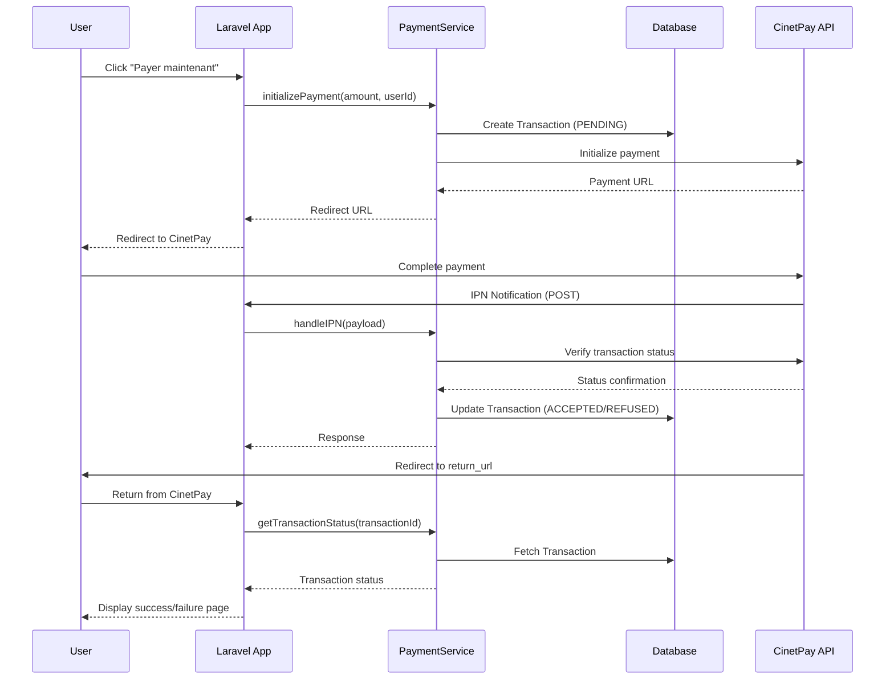
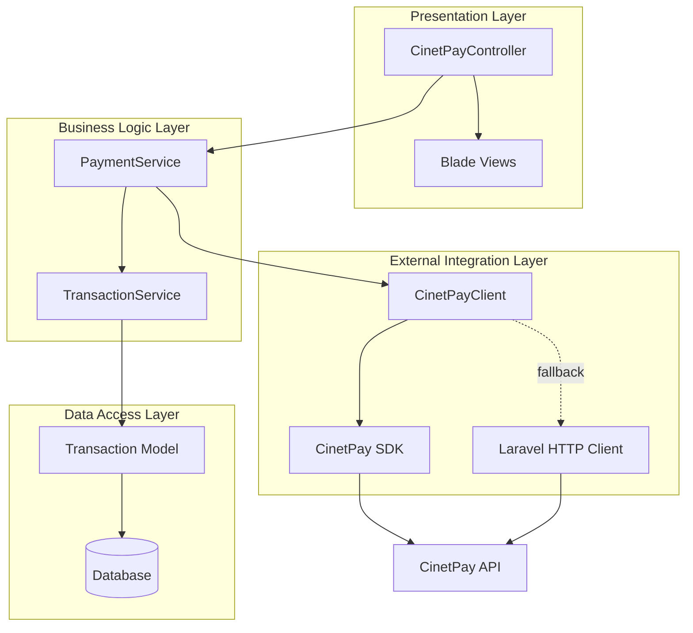

# Design Document: CinetPay Payment Integration

## Overview

Ce document décrit l'architecture et la conception du module d'intégration CinetPay pour Laravel. Le système permet aux utilisateurs d'effectuer des paiements via mobile money en utilisant CinetPay comme passerelle de paiement. L'architecture suit les principes de séparation des responsabilités avec un contrôleur pour la gestion des requêtes HTTP, un service pour la logique métier, et un client pour la communication avec l'API CinetPay.

## Architecture

### Diagramme de Flux de Paiement



### Architecture en Couches



## Components and Interfaces

### 1. CinetPayController

Responsable de la gestion des requêtes HTTP liées aux paiements.

**Méthodes:**

```php
class CinetPayController extends Controller
{
    // Affiche le récapitulatif avant paiement
    public function showPaymentSummary(Request $request): View
    
    // Initialise une transaction et redirige vers CinetPay
    public function initiatePayment(Request $request): RedirectResponse
    
    // Reçoit les notifications IPN de CinetPay
    public function handleIPN(Request $request): JsonResponse
    
    // Gère le retour utilisateur après paiement
    public function handleReturn(Request $request, string $transactionId): View
    
    // Annule une transaction
    public function cancelPayment(string $transactionId): RedirectResponse
}
```

### 2. PaymentService

Contient la logique métier pour la gestion des paiements.

**Méthodes:**

```php
class PaymentService
{
    // Initialise un nouveau paiement
    public function initializePayment(
        float $amount,
        int $userId,
        array $metadata = []
    ): Transaction
    
    // Traite une notification IPN
    public function processIPN(array $payload): bool
    
    // Vérifie le statut d'une transaction auprès de CinetPay
    public function verifyTransactionStatus(string $transactionId): PaymentStatus
    
    // Met à jour le statut d'une transaction
    public function updateTransactionStatus(
        string $transactionId,
        PaymentStatus $newStatus
    ): Transaction
    
    // Récupère une transaction par son ID
    public function getTransaction(string $transactionId): ?Transaction
}
```

### 3. CinetPayClient

Gère la communication avec l'API CinetPay.

**Méthodes:**

```php
class CinetPayClient
{
    // Initialise un paiement sur CinetPay
    public function initializePayment(array $data): array
    
    // Vérifie le statut d'une transaction
    public function checkTransactionStatus(string $transactionId): array
    
    // Valide la signature d'une notification
    public function validateSignature(array $payload): bool
    
    // Gère les retries avec exponential backoff
    private function retryWithBackoff(callable $operation, int $maxAttempts = 3): mixed
}
```

### 4. Transaction Model

Représente une transaction de paiement dans la base de données.

**Attributs:**

```php
class Transaction extends Model
{
    protected $fillable = [
        'transaction_id',      // UUID unique
        'user_id',            // Foreign key vers users
        'amount',             // Montant en devise locale
        'currency',           // Code devise (XOF, etc.)
        'status',             // Enum: PENDING, ACCEPTED, REFUSED
        'return_url',         // URL de retour utilisateur
        'notify_url',         // URL de notification IPN
        'cinetpay_payment_id', // ID de paiement CinetPay
        'metadata',           // JSON pour données additionnelles
        'verified_at',        // Timestamp de vérification
    ];
    
    protected $casts = [
        'status' => PaymentStatus::class,
        'metadata' => 'array',
        'verified_at' => 'datetime',
    ];
    
    // Relations
    public function user(): BelongsTo
    
    // Scopes
    public function scopePending(Builder $query): Builder
    public function scopeAccepted(Builder $query): Builder
    public function scopeRefused(Builder $query): Builder
}
```

### 5. PaymentStatus Enum

Définit les statuts possibles d'une transaction.

```php
enum PaymentStatus: string
{
    case PENDING = 'pending';
    case ACCEPTED = 'accepted';
    case REFUSED = 'refused';
    
    // Vérifie si une transition est valide
    public function canTransitionTo(PaymentStatus $newStatus): bool
    {
        return match($this) {
            self::PENDING => in_array($newStatus, [self::ACCEPTED, self::REFUSED]),
            self::ACCEPTED, self::REFUSED => false,
        };
    }
    
    // Retourne si le statut est terminal
    public function isTerminal(): bool
    {
        return in_array($this, [self::ACCEPTED, self::REFUSED]);
    }
}
```

## Data Models

### Table: transactions

```sql
CREATE TABLE transactions (
    id BIGINT UNSIGNED AUTO_INCREMENT PRIMARY KEY,
    transaction_id VARCHAR(255) UNIQUE NOT NULL,
    user_id BIGINT UNSIGNED NOT NULL,
    amount DECIMAL(10, 2) NOT NULL,
    currency VARCHAR(3) DEFAULT 'XOF',
    status VARCHAR(20) NOT NULL,
    return_url TEXT NOT NULL,
    notify_url TEXT NOT NULL,
    cinetpay_payment_id VARCHAR(255) NULL,
    metadata JSON NULL,
    verified_at TIMESTAMP NULL,
    created_at TIMESTAMP DEFAULT CURRENT_TIMESTAMP,
    updated_at TIMESTAMP DEFAULT CURRENT_TIMESTAMP ON UPDATE CURRENT_TIMESTAMP,
    
    FOREIGN KEY (user_id) REFERENCES users(id) ON DELETE CASCADE,
    INDEX idx_transaction_id (transaction_id),
    INDEX idx_user_id (user_id),
    INDEX idx_status (status),
    INDEX idx_created_at (created_at)
);
```

### Configuration (.env)

```env
CINETPAY_API_KEY=your_api_key_here
CINETPAY_SITE_ID=your_site_id_here
CINETPAY_SECRET_KEY=your_secret_key_here
CINETPAY_CURRENCY=XOF
CINETPAY_NOTIFY_URL="${APP_URL}/api/cinetpay/ipn"
CINETPAY_RETURN_URL="${APP_URL}/payment/return"
```

## Correctness Properties

*Une propriété est une caractéristique ou un comportement qui doit être vrai pour toutes les exécutions valides d'un système - essentiellement, une déclaration formelle sur ce que le système doit faire. Les propriétés servent de pont entre les spécifications lisibles par l'homme et les garanties de correction vérifiables par machine.*

### Property 1: Transaction Uniqueness
*For any* two transactions created by the system, their transaction_id values must be unique.
**Validates: Requirements 1.2**

### Property 2: Transaction User Association
*For any* transaction created, it must be associated with exactly one authenticated user.
**Validates: Requirements 1.3**

### Property 3: Transaction Amount Persistence
*For any* transaction created with an amount, retrieving that transaction from the database must return the same amount value.
**Validates: Requirements 1.4**

### Property 4: Transaction URLs Definition
*For any* transaction created, both return_url and notify_url fields must be non-empty strings.
**Validates: Requirements 1.5**

### Property 5: Credentials Not in Logs
*For any* log entry created by the system, it must not contain the strings matching API_KEY, SITE_ID, or SECRET_KEY values.
**Validates: Requirements 2.4**

### Property 6: IPN Verification Before Update
*For any* IPN notification received, the transaction status must not change until after a successful API verification call to CinetPay.
**Validates: Requirements 3.4, 4.4**

### Property 7: Status Update on Successful Verification
*For any* transaction verification that returns a success status from CinetPay, the local transaction status must be updated to ACCEPTED.
**Validates: Requirements 3.5**

### Property 8: Status Update on Failed Verification
*For any* transaction verification that returns a failure status from CinetPay, the local transaction status must be updated to REFUSED.
**Validates: Requirements 3.6**

### Property 9: IPN Logging
*For any* IPN notification received, a log entry containing the notification payload must be created.
**Validates: Requirements 3.7, 7.2**

### Property 10: Failed Verification Preserves Status
*For any* transaction where CinetPay verification fails (network error, timeout, etc.), the transaction status must remain unchanged from its previous value.
**Validates: Requirements 3.8**

### Property 11: API Call Uses Correct Transaction ID
*For any* verification API call made to CinetPay, the request must include the transaction_id that matches the transaction being verified.
**Validates: Requirements 4.2**

### Property 12: Initial Status is PENDING
*For any* newly created transaction, its initial status must be PENDING.
**Validates: Requirements 5.2**

### Property 13: ACCEPTED is Terminal
*For any* transaction with status ACCEPTED, attempting to change its status to any other value must fail or be rejected.
**Validates: Requirements 5.5**

### Property 14: REFUSED is Terminal
*For any* transaction with status REFUSED, attempting to change its status to any other value must fail or be rejected.
**Validates: Requirements 5.6**

### Property 15: Return Triggers Verification
*For any* user return from CinetPay, the system must call the verification API before displaying the result page.
**Validates: Requirements 6.1**

### Property 16: Success Redirect for ACCEPTED
*For any* transaction with status ACCEPTED when user returns, the response must be a redirect to the success page.
**Validates: Requirements 6.2**

### Property 17: Failure Redirect for REFUSED
*For any* transaction with status REFUSED when user returns, the response must be a redirect to the failure page.
**Validates: Requirements 6.3**

### Property 18: Transaction Details on Result Pages
*For any* success or failure page rendered, the response must contain the transaction_id and amount.
**Validates: Requirements 6.5**

### Property 19: Initiation Logging
*For any* transaction initiated, a log entry containing both transaction_id and amount must be created.
**Validates: Requirements 7.1**

### Property 20: API Call Logging
*For any* API call made to CinetPay, log entries for both the request and response must be created.
**Validates: Requirements 7.3**

### Property 21: Status Change Logging
*For any* transaction status change, a log entry containing both the old status and new status must be created.
**Validates: Requirements 7.4**

### Property 22: Error Logging
*For any* exception or error that occurs, a log entry containing the error message and stack trace must be created.
**Validates: Requirements 7.5**

### Property 23: SDK Exception Conversion
*For any* exception thrown by the CinetPay SDK, it must be caught and converted to an application-specific exception type.
**Validates: Requirements 8.4**

### Property 24: Summary Page Shows Amount
*For any* payment summary page rendered, the response must contain the payment amount.
**Validates: Requirements 9.2**

### Property 25: Summary Page Shows Transaction ID
*For any* payment summary page rendered, the response must contain the transaction_id.
**Validates: Requirements 9.3**

### Property 26: Error Response Logging
*For any* error response received from CinetPay, a log entry must be created and a user-friendly error message must be returned.
**Validates: Requirements 10.2**

### Property 27: Network Timeout Retry
*For any* network timeout when calling CinetPay API, the system must retry the request exactly 3 times before failing.
**Validates: Requirements 10.3**

### Property 28: Malformed IPN Handling
*For any* malformed or invalid IPN notification received, the system must handle it gracefully without throwing an unhandled exception.
**Validates: Requirements 10.5**

## Error Handling

### Exception Hierarchy

```php
// Base exception pour le module de paiement
class PaymentException extends Exception {}

// Exception de configuration
class PaymentConfigurationException extends PaymentException {}

// Exception de communication avec CinetPay
class CinetPayApiException extends PaymentException {}

// Exception de validation
class PaymentValidationException extends PaymentException {}

// Exception de transition de statut invalide
class InvalidStatusTransitionException extends PaymentException {}
```

### Stratégies de Gestion d'Erreurs

1. **Erreurs de Configuration**: Lever une `PaymentConfigurationException` au démarrage si les credentials sont manquants
2. **Erreurs API**: Retry avec exponential backoff (1s, 2s, 4s) puis lever `CinetPayApiException`
3. **Erreurs de Validation**: Lever `PaymentValidationException` avec détails de validation
4. **Erreurs de Transition**: Lever `InvalidStatusTransitionException` si transition invalide
5. **Erreurs IPN**: Logger l'erreur mais retourner 200 OK pour éviter les retries CinetPay

### Logging Strategy

Tous les logs utilisent le channel `cinetpay` avec les niveaux suivants:
- **DEBUG**: Détails des requêtes/réponses API
- **INFO**: Création de transaction, changements de statut
- **WARNING**: Retries, timeouts
- **ERROR**: Exceptions, échecs de vérification
- **CRITICAL**: Erreurs de configuration, corruption de données

## Testing Strategy

### Dual Testing Approach

Le système sera testé avec deux approches complémentaires:

1. **Unit Tests**: Vérifient des exemples spécifiques, cas limites et conditions d'erreur
2. **Property-Based Tests**: Vérifient les propriétés universelles sur tous les inputs

Les deux types de tests sont nécessaires pour une couverture complète. Les tests unitaires capturent des bugs concrets, tandis que les tests basés sur les propriétés vérifient la correction générale.

### Property-Based Testing Configuration

**Framework**: Nous utiliserons **Pest PHP** avec le plugin **pest-plugin-faker** pour les tests basés sur les propriétés.

**Configuration des Tests**:
- Minimum 100 itérations par test de propriété
- Chaque test doit référencer sa propriété du document de design
- Format de tag: `Feature: cinetpay-payment-integration, Property {number}: {property_text}`

**Exemple de Test de Propriété**:

```php
// Feature: cinetpay-payment-integration, Property 1: Transaction Uniqueness
test('all generated transaction IDs are unique', function () {
    $transactionIds = [];
    
    // Generate 100 transactions
    for ($i = 0; $i < 100; $i++) {
        $transaction = Transaction::factory()->create();
        $transactionIds[] = $transaction->transaction_id;
    }
    
    // Verify all IDs are unique
    expect($transactionIds)
        ->toHaveCount(100)
        ->and(array_unique($transactionIds))
        ->toHaveCount(100);
});
```

### Unit Testing Focus

Les tests unitaires se concentreront sur:
- Exemples spécifiques de flux de paiement
- Cas limites (montants négatifs, IDs invalides)
- Conditions d'erreur (API indisponible, credentials manquants)
- Points d'intégration entre composants

### Test Coverage Goals

- **Controllers**: 80%+ coverage
- **Services**: 90%+ coverage
- **Models**: 85%+ coverage
- **Client**: 85%+ coverage

### Mocking Strategy

- **CinetPay API**: Utiliser des mocks pour éviter les appels réels
- **Database**: Utiliser des transactions pour rollback après chaque test
- **Logs**: Utiliser un log channel de test pour vérifier les entrées

## Security Considerations

1. **Credentials Management**: Toutes les credentials sont stockées dans `.env` et jamais committées
2. **CSRF Protection**: L'endpoint IPN est exclu du middleware CSRF
3. **Signature Validation**: Toutes les notifications IPN sont validées via signature
4. **SQL Injection**: Utilisation d'Eloquent ORM pour prévenir les injections
5. **XSS Protection**: Toutes les sorties utilisateur sont échappées via Blade
6. **Rate Limiting**: Limiter les tentatives de paiement par utilisateur (10/minute)
7. **Audit Trail**: Tous les changements de statut sont loggés avec timestamps

## Performance Considerations

1. **Database Indexing**: Index sur transaction_id, user_id, status, created_at
2. **Caching**: Pas de cache pour les transactions (données critiques)
3. **Queue Jobs**: Les notifications IPN sont traitées de manière synchrone pour garantir la cohérence
4. **Connection Pooling**: Réutilisation des connexions HTTP pour les appels API
5. **Timeout Configuration**: 30s pour les appels API CinetPay

## Deployment Considerations

1. **Environment Variables**: Vérifier que toutes les variables CinetPay sont configurées
2. **Webhook Configuration**: Configurer l'URL IPN dans le dashboard CinetPay
3. **SSL Certificate**: S'assurer que l'application utilise HTTPS pour les callbacks
4. **Log Rotation**: Configurer la rotation des logs pour éviter la saturation
5. **Monitoring**: Mettre en place des alertes pour les échecs de paiement
