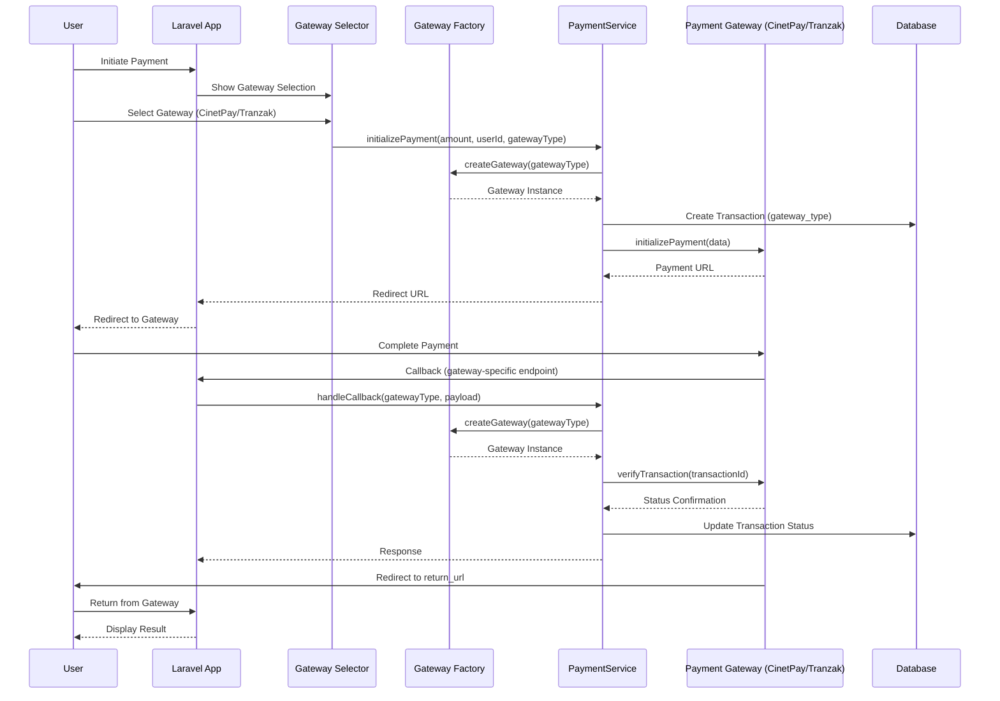

# Design Document: Multi-Gateway Payment Support

## Overview

Ce document décrit l'architecture et la conception pour étendre le module de paiement Laravel existant afin de supporter plusieurs passerelles de paiement (CinetPay et Tranzak). L'architecture utilise le pattern Strategy avec une interface commune pour toutes les passerelles, permettant une extensibilité future. Le système maintient la compatibilité ascendante avec les transactions CinetPay existantes tout en ajoutant le support pour Tranzak.

## Architecture

### Diagramme de Flux Multi-Passerelles



### Architecture en Couches avec Pattern Strategy

```mermaid
graph TB
    subgraph "Presentation Layer"
        C[PaymentController]
        GV[Gateway Selection View]
        RV[Result Views]
    end
    
    subgraph "Business Logic Layer"
        PS[PaymentService]
        GF[GatewayFactory]
    end
    
    subgraph "Gateway Abstraction Layer"
        GI[PaymentGatewayInterface]
        CG[CinetPayGateway]
        TG[TranzakGateway]
    end
    
    subgraph "Data Layer"
        T[Transaction Model]
        GT[GatewayType Enum]
        DB[(Database)]
    end
    
    C --> GV
    C --> PS
    C --> RV
    PS --> GF
    GF --> GI
    GI <|.. CG
    GI <|.. TG
    PS --> T
    T --> GT
    T --> DB
    CG --> CP[CinetPay API]
    TG --> TA[Tranzak API]
```

## Components and Interfaces

### 1. PaymentGatewayInterface

Interface commune que toutes les passerelles doivent implémenter.

**Méthodes:**

```php
interface PaymentGatewayInterface
{
    // Retourne le nom de la passerelle
    public function getGatewayName(): string;
    
    // Retourne le type de passerelle (enum)
    public function getGatewayType(): GatewayType;
    
    // Initialise un paiement et retourne l'URL de redirection
    public function initializePayment(array $data): array;
    
    // Vérifie le statut d'une transaction
    public function verifyTransaction(string $transactionId): array;
    
    // Traite un callback de la passerelle
    public function handleCallback(array $payload): array;
    
    // Valide la signature/authentification du callback
    public function validateCallback(array $payload): bool;
}
```

### 2. CinetPayGateway

Implémentation de l'interface pour CinetPay (refactorisation du code existant).

**Méthodes:**

```php
class CinetPayGateway implements PaymentGatewayInterface
{
    private CinetPayClient $client;
    private array $config;
    
    public function __construct(CinetPayClient $client, array $config)
    {
        $this->client = $client;
        $this->config = $config;
    }
    
    public function getGatewayName(): string
    {
        return 'CinetPay';
    }
    
    public function getGatewayType(): GatewayType
    {
        return GatewayType::CINETPAY;
    }
    
    public function initializePayment(array $data): array
    {
        // Utilise le CinetPayClient existant
        return $this->client->initializePayment($data);
    }
    
    public function verifyTransaction(string $transactionId): array
    {
        return $this->client->checkTransactionStatus($transactionId);
    }
    
    public function handleCallback(array $payload): array
    {
        // Logique existante de traitement IPN
        return [
            'transaction_id' => $payload['transaction_id'],
            'status' => $this->mapStatus($payload['status']),
            'verified' => true,
        ];
    }
    
    public function validateCallback(array $payload): bool
    {
        return $this->client->validateSignature($payload);
    }
    
    private function mapStatus(string $gatewayStatus): PaymentStatus
    {
        // Mappe les statuts CinetPay vers PaymentStatus
    }
}
```

### 3. TranzakGateway

Nouvelle implémentation pour Tranzak.

**Méthodes:**

```php
class TranzakGateway implements PaymentGatewayInterface
{
    private TranzakClient $client;
    private array $config;
    
    public function __construct(TranzakClient $client, array $config)
    {
        $this->client = $client;
        $this->config = $config;
    }
    
    public function getGatewayName(): string
    {
        return 'Tranzak';
    }
    
    public function getGatewayType(): GatewayType
    {
        return GatewayType::TRANZAK;
    }
    
    public function initializePayment(array $data): array
    {
        // Appelle l'API Tranzak pour initialiser le paiement
        $response = $this->client->createPayment([
            'amount' => $data['amount'],
            'currency' => $data['currency'] ?? 'XAF',
            'description' => $data['description'] ?? 'Payment',
            'return_url' => $data['return_url'],
            'cancel_url' => $data['cancel_url'],
            'callback_url' => $data['notify_url'],
            'app_id' => $this->config['app_id'],
        ]);
        
        return [
            'payment_url' => $response['links']['payment_url'],
            'payment_id' => $response['request_id'],
        ];
    }
    
    public function verifyTransaction(string $transactionId): array
    {
        return $this->client->getPaymentStatus($transactionId);
    }
    
    public function handleCallback(array $payload): array
    {
        return [
            'transaction_id' => $payload['mchTransactionRef'] ?? $payload['request_id'],
            'status' => $this->mapStatus($payload['status']),
            'verified' => true,
        ];
    }
    
    public function validateCallback(array $payload): bool
    {
        // Tranzak utilise l'API key pour l'authentification
        // Validation via vérification API
        return true;
    }
    
    private function mapStatus(string $gatewayStatus): PaymentStatus
    {
        return match(strtoupper($gatewayStatus)) {
            'SUCCESSFUL', 'SUCCESS' => PaymentStatus::ACCEPTED,
            'FAILED', 'CANCELLED' => PaymentStatus::REFUSED,
            default => PaymentStatus::PENDING,
        };
    }
}
```

### 4. TranzakClient

Client HTTP pour communiquer avec l'API Tranzak.

**Méthodes:**

```php
class TranzakClient
{
    private string $apiKey;
    private string $appId;
    private string $baseUrl;
    private Http $http;
    
    public function __construct(string $apiKey, string $appId, string $baseUrl = 'https://dsapi.tranzak.me')
    {
        $this->apiKey = $apiKey;
        $this->appId = $appId;
        $this->baseUrl = $baseUrl;
        $this->http = Http::withHeaders([
            'Authorization' => 'Bearer ' . $apiKey,
            'Content-Type' => 'application/json',
        ]);
    }
    
    // Crée une nouvelle demande de paiement
    public function createPayment(array $data): array
    {
        $response = $this->http->post("{$this->baseUrl}/v1/payment/request", $data);
        
        if (!$response->successful()) {
            throw new TranzakApiException(
                "Failed to create payment: " . $response->body(),
                $response->status()
            );
        }
        
        return $response->json();
    }
    
    // Vérifie le statut d'un paiement
    public function getPaymentStatus(string $requestId): array
    {
        $response = $this->http->get("{$this->baseUrl}/v1/payment/status/{$requestId}");
        
        if (!$response->successful()) {
            throw new TranzakApiException(
                "Failed to get payment status: " . $response->body(),
                $response->status()
            );
        }
        
        return $response->json();
    }
    
    // Gère les retries avec exponential backoff
    private function retryWithBackoff(callable $operation, int $maxAttempts = 3): mixed
    {
        $attempt = 0;
        $delay = 1;
        
        while ($attempt < $maxAttempts) {
            try {
                return $operation();
            } catch (Exception $e) {
                $attempt++;
                if ($attempt >= $maxAttempts) {
                    throw $e;
                }
                sleep($delay);
                $delay *= 2;
            }
        }
    }
}
```

### 5. GatewayFactory

Factory pour créer les instances de passerelles.

**Méthodes:**

```php
class GatewayFactory
{
    private array $config;
    
    public function __construct(array $config)
    {
        $this->config = $config;
    }
    
    // Crée une instance de passerelle basée sur le type
    public function createGateway(GatewayType $gatewayType): PaymentGatewayInterface
    {
        return match($gatewayType) {
            GatewayType::CINETPAY => $this->createCinetPayGateway(),
            GatewayType::TRANZAK => $this->createTranzakGateway(),
        };
    }
    
    private function createCinetPayGateway(): CinetPayGateway
    {
        $config = $this->config['cinetpay'];
        
        if (empty($config['api_key']) || empty($config['site_id'])) {
            throw new PaymentConfigurationException('CinetPay credentials are missing');
        }
        
        $client = new CinetPayClient(
            $config['api_key'],
            $config['site_id'],
            $config['secret_key']
        );
        
        return new CinetPayGateway($client, $config);
    }
    
    private function createTranzakGateway(): TranzakGateway
    {
        $config = $this->config['tranzak'];
        
        if (empty($config['api_key']) || empty($config['app_id'])) {
            throw new PaymentConfigurationException('Tranzak credentials are missing');
        }
        
        $client = new TranzakClient(
            $config['api_key'],
            $config['app_id']
        );
        
        return new TranzakGateway($client, $config);
    }
    
    // Retourne les passerelles disponibles (avec credentials valides)
    public function getAvailableGateways(): array
    {
        $available = [];
        
        foreach (GatewayType::cases() as $type) {
            try {
                $this->createGateway($type);
                $available[] = $type;
            } catch (PaymentConfigurationException $e) {
                // Gateway non disponible
            }
        }
        
        return $available;
    }
}
```

### 6. GatewayType Enum

Enum définissant les types de passerelles supportées.

```php
enum GatewayType: string
{
    case CINETPAY = 'cinetpay';
    case TRANZAK = 'tranzak';
    
    // Retourne le nom d'affichage
    public function getDisplayName(): string
    {
        return match($this) {
            self::CINETPAY => 'CinetPay',
            self::TRANZAK => 'Tranzak',
        };
    }
    
    // Retourne la description
    public function getDescription(): string
    {
        return match($this) {
            self::CINETPAY => 'Paiement via Mobile Money (Orange, MTN, Moov)',
            self::TRANZAK => 'Paiement via Mobile Money et cartes bancaires',
        };
    }
    
    // Retourne le chemin du logo
    public function getLogoPath(): string
    {
        return match($this) {
            self::CINETPAY => '/images/gateways/cinetpay.png',
            self::TRANZAK => '/images/gateways/tranzak.png',
        };
    }
}
```

### 7. PaymentService (Refactorisé)

Service mis à jour pour supporter plusieurs passerelles.

**Méthodes:**

```php
class PaymentService
{
    private GatewayFactory $gatewayFactory;
    
    public function __construct(GatewayFactory $gatewayFactory)
    {
        $this->gatewayFactory = $gatewayFactory;
    }
    
    // Initialise un paiement avec une passerelle spécifique
    public function initializePayment(
        float $amount,
        int $userId,
        GatewayType $gatewayType,
        array $metadata = []
    ): Transaction
    {
        // Crée l'instance de passerelle
        $gateway = $this->gatewayFactory->createGateway($gatewayType);
        
        // Crée la transaction
        $transaction = Transaction::create([
            'transaction_id' => Str::uuid(),
            'user_id' => $userId,
            'amount' => $amount,
            'currency' => 'XAF',
            'status' => PaymentStatus::PENDING,
            'gateway_type' => $gatewayType,
            'return_url' => route('payment.return', ['transactionId' => '__TRANSACTION_ID__']),
            'notify_url' => route('payment.callback.' . $gatewayType->value),
            'metadata' => $metadata,
        ]);
        
        Log::info("Payment initiated", [
            'transaction_id' => $transaction->transaction_id,
            'amount' => $amount,
            'gateway' => $gatewayType->value,
        ]);
        
        // Initialise le paiement avec la passerelle
        $paymentData = $gateway->initializePayment([
            'transaction_id' => $transaction->transaction_id,
            'amount' => $amount,
            'currency' => 'XAF',
            'return_url' => $transaction->return_url,
            'notify_url' => $transaction->notify_url,
            'description' => $metadata['description'] ?? 'Payment',
        ]);
        
        // Met à jour la transaction avec l'ID de paiement de la passerelle
        $transaction->update([
            'gateway_payment_id' => $paymentData['payment_id'],
        ]);
        
        return $transaction;
    }
    
    // Traite un callback de passerelle
    public function processCallback(GatewayType $gatewayType, array $payload): bool
    {
        $gateway = $this->gatewayFactory->createGateway($gatewayType);
        
        Log::info("Callback received", [
            'gateway' => $gatewayType->value,
            'payload' => $payload,
        ]);
        
        // Valide le callback
        if (!$gateway->validateCallback($payload)) {
            Log::warning("Invalid callback signature", [
                'gateway' => $gatewayType->value,
            ]);
            return false;
        }
        
        // Traite le callback
        $callbackData = $gateway->handleCallback($payload);
        $transactionId = $callbackData['transaction_id'];
        
        // Vérifie le statut auprès de la passerelle
        $verificationData = $gateway->verifyTransaction($transactionId);
        $newStatus = $this->mapGatewayStatus($verificationData);
        
        // Met à jour la transaction
        $transaction = Transaction::where('transaction_id', $transactionId)->first();
        
        if ($transaction && $transaction->status->canTransitionTo($newStatus)) {
            $oldStatus = $transaction->status;
            $transaction->update([
                'status' => $newStatus,
                'verified_at' => now(),
            ]);
            
            Log::info("Transaction status updated", [
                'transaction_id' => $transactionId,
                'old_status' => $oldStatus->value,
                'new_status' => $newStatus->value,
                'gateway' => $gatewayType->value,
            ]);
        }
        
        return true;
    }
    
    // Vérifie le statut d'une transaction
    public function verifyTransactionStatus(string $transactionId): PaymentStatus
    {
        $transaction = Transaction::where('transaction_id', $transactionId)->firstOrFail();
        $gateway = $this->gatewayFactory->createGateway($transaction->gateway_type);
        
        $verificationData = $gateway->verifyTransaction($transactionId);
        $newStatus = $this->mapGatewayStatus($verificationData);
        
        if ($transaction->status->canTransitionTo($newStatus)) {
            $transaction->update([
                'status' => $newStatus,
                'verified_at' => now(),
            ]);
        }
        
        return $transaction->fresh()->status;
    }
    
    // Retourne les passerelles disponibles
    public function getAvailableGateways(): array
    {
        return $this->gatewayFactory->getAvailableGateways();
    }
    
    private function mapGatewayStatus(array $verificationData): PaymentStatus
    {
        // Logique de mapping basée sur les données de vérification
        return $verificationData['status'] ?? PaymentStatus::PENDING;
    }
}
```

### 8. Transaction Model (Mis à jour)

Modèle mis à jour pour inclure le type de passerelle.

**Nouveaux attributs:**

```php
class Transaction extends Model
{
    protected $fillable = [
        'transaction_id',
        'user_id',
        'amount',
        'currency',
        'status',
        'gateway_type',           // NOUVEAU
        'gateway_payment_id',     // NOUVEAU (remplace cinetpay_payment_id)
        'return_url',
        'notify_url',
        'metadata',
        'verified_at',
    ];
    
    protected $casts = [
        'status' => PaymentStatus::class,
        'gateway_type' => GatewayType::class,  // NOUVEAU
        'metadata' => 'array',
        'verified_at' => 'datetime',
    ];
    
    // Scopes par passerelle
    public function scopeByGateway(Builder $query, GatewayType $gatewayType): Builder
    {
        return $query->where('gateway_type', $gatewayType);
    }
}
```

## Data Models

### Migration: Add Gateway Support to Transactions

```php
Schema::table('transactions', function (Blueprint $table) {
    // Ajoute le type de passerelle avec valeur par défaut pour compatibilité
    $table->string('gateway_type')->default('cinetpay')->after('status');
    
    // Renomme cinetpay_payment_id en gateway_payment_id
    $table->renameColumn('cinetpay_payment_id', 'gateway_payment_id');
    
    // Ajoute un index sur gateway_type
    $table->index('gateway_type');
});
```

### Configuration (.env)

```env
# CinetPay (existant)
CINETPAY_API_KEY=your_api_key_here
CINETPAY_SITE_ID=your_site_id_here
CINETPAY_SECRET_KEY=your_secret_key_here
CINETPAY_CURRENCY=XOF

# Tranzak (nouveau)
TRANZAK_API_KEY=SAND_6D8D545EFC4E47399EFC10563F432517
TRANZAK_APP_ID=ap61k92t8on4vc
TRANZAK_CURRENCY=XAF
TRANZAK_BASE_URL=https://dsapi.tranzak.me
```

### Configuration (config/payment.php)

```php
return [
    'default_gateway' => env('PAYMENT_DEFAULT_GATEWAY', 'cinetpay'),
    
    'gateways' => [
        'cinetpay' => [
            'api_key' => env('CINETPAY_API_KEY'),
            'site_id' => env('CINETPAY_SITE_ID'),
            'secret_key' => env('CINETPAY_SECRET_KEY'),
            'currency' => env('CINETPAY_CURRENCY', 'XOF'),
            'notify_url' => env('APP_URL') . '/api/cinetpay/callback',
            'return_url' => env('APP_URL') . '/payment/return',
        ],
        
        'tranzak' => [
            'api_key' => env('TRANZAK_API_KEY'),
            'app_id' => env('TRANZAK_APP_ID'),
            'currency' => env('TRANZAK_CURRENCY', 'XAF'),
            'base_url' => env('TRANZAK_BASE_URL', 'https://dsapi.tranzak.me'),
            'notify_url' => env('APP_URL') . '/api/tranzak/callback'),
            'return_url' => env('APP_URL') . '/payment/return',
        ],
    ],
];
```

## Correctness Properties

*Une propriété est une caractéristique ou un comportement qui doit être vrai pour toutes les exécutions valides d'un système - essentiellement, une déclaration formelle sur ce que le système doit faire. Les propriétés servent de pont entre les spécifications lisibles par l'homme et les garanties de correction vérifiables par machine.*


### Property Reflection

Après analyse du prework, voici les propriétés identifiées avec élimination des redondances:

**Propriétés combinées:**
- Les propriétés 10.1, 10.2, 10.3 (affichage logos, noms, descriptions) peuvent être combinées en une seule propriété sur le contenu complet de la sélection
- Les propriétés 11.2, 11.3, 11.4 (logging de différentes opérations) sont toutes couvertes par 11.1 (inclusion de gateway_type dans les logs)
- Les propriétés 4.2 et 7.6 (utilisation des credentials) sont redondantes - 7.6 est plus générale

**Propriétés à conserver:**
- Propriétés sur le stockage et l'immutabilité du gateway_type (1.4, 5.1, 5.4)
- Propriétés sur le routage correct des callbacks (6.4, 6.5)
- Propriétés sur la vérification via la bonne passerelle (5.3, 4.5)
- Propriétés sur les exceptions spécifiques par passerelle (8.2, 8.3)
- Propriétés sur la validation des callbacks (12.1, 12.2, 12.4)
- Propriétés sur les retries spécifiques par passerelle (13.3, 13.4)

### Correctness Properties

Property 1: Gateway Type Storage
*For any* transaction created, it must have a non-null gateway_type field stored in the database.
**Validates: Requirements 1.4, 5.1**

Property 2: Gateway Type Immutability
*For any* transaction after creation, attempting to change its gateway_type field must fail or be rejected.
**Validates: Requirements 5.4**

Property 3: Gateway Selection Validation
*For any* gateway type provided as input, the system must validate it is in the list of supported gateway types before proceeding.
**Validates: Requirements 1.5**

Property 4: Correct Gateway Client Selection
*For any* transaction verification, the system must use a gateway client that matches the transaction's stored gateway_type.
**Validates: Requirements 5.3**

Property 5: Tranzak Transaction Gateway Type
*For any* transaction created via Tranzak, its gateway_type field must be set to TRANZAK.
**Validates: Requirements 4.3**

Property 6: CinetPay Transaction Gateway Type
*For any* transaction created via CinetPay, its gateway_type field must be set to CINETPAY.
**Validates: Requirements 9.3**

Property 7: Callback Gateway Identification
*For any* callback received at a gateway-specific endpoint, the system must correctly identify which gateway sent the callback based on the endpoint URL.
**Validates: Requirements 6.4**

Property 8: Callback Delegation to Correct Handler
*For any* callback received, it must be processed by the gateway handler that matches the identified gateway type.
**Validates: Requirements 6.5**

Property 9: CSRF Exclusion for Callbacks
*For any* gateway callback endpoint, CSRF middleware must not block the request.
**Validates: Requirements 6.6**

Property 10: Tranzak Callback Verification
*For any* Tranzak callback received, the system must call the Tranzak API to verify the transaction status before updating the local transaction.
**Validates: Requirements 4.5**

Property 11: Gateway Factory Credentials Injection
*For any* gateway instance created by the factory, it must be configured with the appropriate credentials for that gateway type.
**Validates: Requirements 7.6**

Property 12: Tranzak API Exception Type
*For any* failed Tranzak API call, the exception thrown must be of type TranzakApiException.
**Validates: Requirements 8.2**

Property 13: CinetPay API Exception Type
*For any* failed CinetPay API call, the exception thrown must be of type CinetPayApiException.
**Validates: Requirements 8.3**

Property 14: Gateway Error Logging
*For any* gateway error that occurs, a log entry containing the gateway name must be created.
**Validates: Requirements 8.4, 8.6**

Property 15: User-Friendly Error Messages
*For any* gateway error displayed to users, the message must be user-friendly and not expose technical details or credentials.
**Validates: Requirements 8.5**

Property 16: Credentials Not in Logs
*For any* log entry created by the system, it must not contain any gateway API keys, secret keys, or app IDs.
**Validates: Requirements 3.4**

Property 17: Gateway Selection Display Content
*For any* gateway selection interface rendered, it must contain logos, names, and descriptions for all available gateways.
**Validates: Requirements 10.1, 10.2, 10.3**

Property 18: Unavailable Gateway Disabled
*For any* gateway that is unavailable (missing credentials), its selection option must be disabled in the UI.
**Validates: Requirements 10.4**

Property 19: Unavailable Gateway Explanation
*For any* unavailable gateway displayed, an explanation message must be shown to the user.
**Validates: Requirements 10.5**

Property 20: Transaction Display Shows Gateway
*For any* transaction details displayed, the gateway name or type must be visible to the user.
**Validates: Requirements 5.5**

Property 21: Gateway Type in Payment Logs
*For any* payment operation log entry, it must include the gateway_type field.
**Validates: Requirements 11.1, 11.2, 11.3, 11.4**

Property 22: Tranzak Callback Payload Validation
*For any* Tranzak callback received, the payload structure must be validated before processing.
**Validates: Requirements 12.1**

Property 23: Tranzak Callback Transaction Existence
*For any* Tranzak callback received, the system must verify the referenced transaction exists before processing.
**Validates: Requirements 12.2**

Property 24: Tranzak API Response Validation
*For any* Tranzak API response received, the response format must be validated.
**Validates: Requirements 12.3**

Property 25: Malformed Callback Rejection
*For any* malformed Tranzak callback received, it must be rejected and not update any transaction status.
**Validates: Requirements 12.4**

Property 26: Validation Failure Logging
*For any* validation failure, a log entry with detailed information must be created.
**Validates: Requirements 12.5**

Property 27: Tranzak Retry Configuration
*For any* Tranzak API timeout, the system must retry according to the Tranzak-specific retry configuration.
**Validates: Requirements 13.3**

Property 28: CinetPay Retry Configuration
*For any* CinetPay API timeout, the system must retry according to the CinetPay-specific retry configuration.
**Validates: Requirements 13.4**

Property 29: Retry Logging with Gateway
*For any* retry attempt, a log entry containing the gateway information must be created.
**Validates: Requirements 13.5**

Property 30: Status Update Based on Gateway Verification
*For any* transaction, its status must be updated only after successful verification with the gateway specified by its gateway_type.
**Validates: Requirements 4.6**

## Error Handling

### Exception Hierarchy (Extended)

```php
// Base exception (existante)
class PaymentException extends Exception {}

// Exceptions existantes
class PaymentConfigurationException extends PaymentException {}
class CinetPayApiException extends PaymentException {}
class PaymentValidationException extends PaymentException {}
class InvalidStatusTransitionException extends PaymentException {}

// Nouvelle exception pour Tranzak
class TranzakApiException extends PaymentException {}

// Nouvelle exception pour passerelle non supportée
class UnsupportedGatewayException extends PaymentException {}
```

### Stratégies de Gestion d'Erreurs

1. **Erreurs de Configuration par Passerelle**: 
   - Si credentials Tranzak manquants: désactiver Tranzak dans la liste
   - Si credentials CinetPay manquants: désactiver CinetPay dans la liste
   - Si toutes les passerelles manquent de credentials: lever `PaymentConfigurationException`

2. **Erreurs API Spécifiques**:
   - Tranzak: Lever `TranzakApiException` avec retry selon config Tranzak
   - CinetPay: Lever `CinetPayApiException` avec retry selon config CinetPay

3. **Erreurs de Passerelle Non Supportée**:
   - Lever `UnsupportedGatewayException` si gateway_type invalide

4. **Erreurs de Callback**:
   - Logger l'erreur avec le nom de la passerelle
   - Retourner 200 OK pour éviter les retries de la passerelle
   - Ne pas mettre à jour le statut de la transaction

### Logging Strategy

Tous les logs incluent maintenant le champ `gateway` pour identifier la passerelle:

```php
Log::info("Payment initiated", [
    'transaction_id' => $transactionId,
    'amount' => $amount,
    'gateway' => $gatewayType->value,
]);
```

Niveaux de log:
- **DEBUG**: Détails des requêtes/réponses API par passerelle
- **INFO**: Création de transaction, changements de statut, sélection de passerelle
- **WARNING**: Retries, timeouts, passerelles indisponibles
- **ERROR**: Exceptions, échecs de vérification, callbacks malformés
- **CRITICAL**: Erreurs de configuration, toutes les passerelles indisponibles

## Testing Strategy

### Dual Testing Approach

Le système sera testé avec deux approches complémentaires:

1. **Unit Tests**: Vérifient des exemples spécifiques, cas limites et conditions d'erreur
2. **Property-Based Tests**: Vérifient les propriétés universelles sur tous les inputs

Les deux types de tests sont nécessaires pour une couverture complète.

### Property-Based Testing Configuration

**Framework**: Pest PHP avec pest-plugin-faker

**Configuration**:
- Minimum 100 itérations par test de propriété
- Chaque test référence sa propriété du document de design
- Format de tag: `Feature: multi-gateway-payment-support, Property {number}: {property_text}`

**Exemple de Test de Propriété**:

```php
// Feature: multi-gateway-payment-support, Property 1: Gateway Type Storage
test('all transactions have a gateway_type stored', function () {
    $gateways = [GatewayType::CINETPAY, GatewayType::TRANZAK];
    
    for ($i = 0; $i < 100; $i++) {
        $gateway = fake()->randomElement($gateways);
        $transaction = Transaction::factory()->create([
            'gateway_type' => $gateway,
        ]);
        
        expect($transaction->gateway_type)
            ->not->toBeNull()
            ->toBeInstanceOf(GatewayType::class);
    }
});
```

### Unit Testing Focus

Les tests unitaires se concentreront sur:
- Sélection de passerelle spécifique (CinetPay, Tranzak)
- Factory creation pour chaque type de passerelle
- Callbacks spécifiques à chaque passerelle
- Cas limites (credentials manquants, passerelle non supportée)
- Migration et compatibilité ascendante

### Test Coverage Goals

- **Gateway Interface Implementations**: 90%+ coverage
- **GatewayFactory**: 95%+ coverage
- **PaymentService (refactorisé)**: 90%+ coverage
- **Controllers**: 80%+ coverage
- **TranzakClient**: 85%+ coverage

### Mocking Strategy

- **Gateway APIs**: Utiliser des mocks pour éviter les appels réels
- **Factory**: Tester avec des mocks de gateway pour isoler la logique
- **Database**: Utiliser des transactions pour rollback après chaque test
- **Configuration**: Utiliser des valeurs de test pour les credentials

## Security Considerations

1. **Multi-Gateway Credentials**: Chaque passerelle a ses propres credentials stockées séparément dans `.env`
2. **Callback Endpoints**: Chaque passerelle a son propre endpoint pour éviter la confusion
3. **Signature Validation**: Chaque passerelle valide ses callbacks selon sa propre méthode
4. **Gateway Isolation**: Les erreurs d'une passerelle n'affectent pas les autres
5. **Credential Logging**: Aucune credential n'est loggée, quelle que soit la passerelle
6. **Rate Limiting**: Limiter les tentatives par passerelle séparément

## Performance Considerations

1. **Gateway Factory Caching**: Mettre en cache les instances de gateway pour éviter la recréation
2. **Configuration Loading**: Charger toutes les configs de passerelles une seule fois au démarrage
3. **Database Indexing**: Index sur gateway_type pour les requêtes filtrées par passerelle
4. **Parallel Gateway Checks**: Ne pas vérifier toutes les passerelles si une seule est utilisée
5. **Timeout Configuration**: Timeouts différents par passerelle selon leur SLA

## Deployment Considerations

1. **Environment Variables**: Configurer les credentials pour toutes les passerelles souhaitées
2. **Webhook Configuration**: Configurer les URLs de callback dans chaque dashboard de passerelle
3. **Migration**: Exécuter la migration pour ajouter gateway_type aux transactions existantes
4. **Backward Compatibility**: Vérifier que les transactions CinetPay existantes fonctionnent toujours
5. **Monitoring**: Mettre en place des alertes séparées par passerelle
6. **Feature Flags**: Possibilité d'activer/désactiver des passerelles sans redéploiement

## Extensibility

L'architecture permet d'ajouter facilement de nouvelles passerelles:

1. Créer une nouvelle classe implémentant `PaymentGatewayInterface`
2. Créer un client API pour la nouvelle passerelle
3. Ajouter un nouveau cas dans `GatewayType` enum
4. Ajouter la configuration dans `config/payment.php`
5. Mettre à jour `GatewayFactory` pour créer la nouvelle passerelle
6. Ajouter les routes de callback spécifiques
7. Ajouter les tests pour la nouvelle passerelle

Aucune modification du code existant n'est nécessaire grâce au pattern Strategy.
